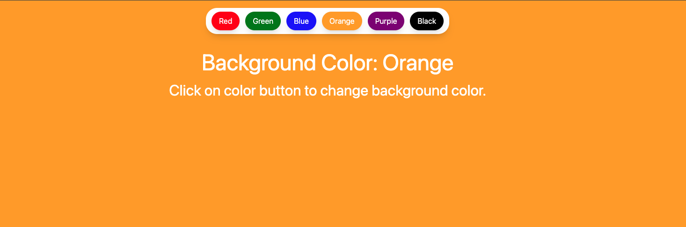

🎨 Background Color Changer
A simple and interactive React application that allows users to change the background color of the page by clicking on different color buttons.

🛠 Tech Stack
React – A JavaScript library for building user interfaces

Tailwind CSS – A utility-first CSS framework for styling

🚀 Project Background
The Background Color Changer project was created as a fun and practical way to explore the power of React state management and Tailwind CSS utilities. It demonstrates how UI interactivity can be achieved with clean, reusable components and modern styling techniques.

✨ Features
Click buttons to change the background color

Responsive and minimalist UI

Built with functional components and React Hooks

Styled using Tailwind CSS utility classes

📦 Getting Started
Clone the repository

git clone https://github.com/vedprakashpoddar92/React---Background-Changer.git
cd background-color-changer
Install dependencies

npm install
Start the development server

npm run dev
Open http://localhost:3000 in your browser to see it in action.

🖼️ Example
